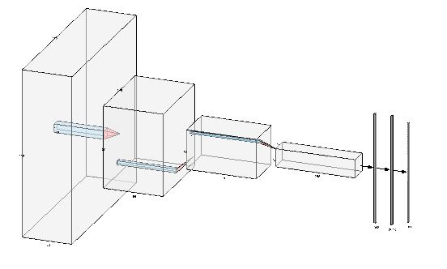

# CNN_MarineMammal_Prediction
This is a basic Marine Mammal and Sharks detection-based on convolutional neural network model from static images.  The classification stage is now complete; after some months, I will update the entire code for mammal and shark detections.
I plan to integrate with major sharks and Rays species. After that I will make a web app for automated detection and identification. When I used sharks of the world book and sharks of the Arabian sea to identify sharks last year, I had a nightmare with shark identification. 

The convolutional Neural Network CNN works by getting an image, designating it some weightage based on the different objects of the image, and then distinguishing them from each other.
# CNN model configuration 

# Image sources 

All images were collected from internet, mostly google image sections. 

# Model performance 
Model loss and accuracy 

# Declarations
This project does not receive any financial assistance. This is a fun project.
# Species list [This model can identify 26 species--Up to the date (8/7/2022)]
0. 'Beluga whale',
 1. 'Blacktip shark',
 2. 'Blue whale',
 3. 'bowhead whale',
 4. 'Bull shark',
 5. 'Fin whale',
 6. 'anges dolphin',
 7. 'Ganges shark',
 8. 'Graceful shark',
 9. 'Gray whale',
 10. 'Greysharpnose shark',
 11. 'Hardnose shark',
 12. 'Humpback whale',
 13. 'IndoPacific dolphin',
 14. 'Longfinnned whale',
 15. 'Milk shark',
 16. 'Pigeye shark',
 17. 'River dolphin',
 18. 'Scallopedhammerhead shark',
 19. 'Sharpnose shark',
 20. 'Silky shark',
 21. 'Spadenose shark',
 22. 'Sperm whale',
 23. 'Spinner shark',
 24. 'pottail shark',
 25. 'Tiger shark',
 26. 'Zebra shark'
