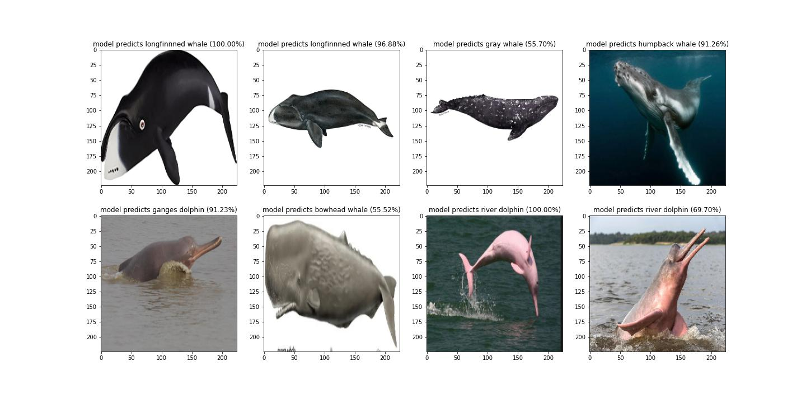

# CNN_MarineMammal_Prediction
This is a basic Marine Mammal and Sharks detection-based convolutional neural network model from static images.  The classification stage is now complete; after some months, I will update the entire code for mammal and shark detections.
I plan to integrate with major shark species. When I used sharks of the world book and sharks of the Arabian sea to identify sharks last year, I had a nightmare with shark identification. 

The convolutional Neural Network CNN works by getting an image, designating it some weightage based on the different objects of the image, and then distinguishing them from each other.

Model performance : Model loss and accuracy 

